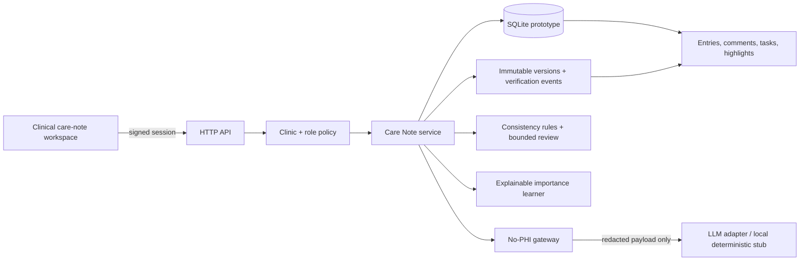
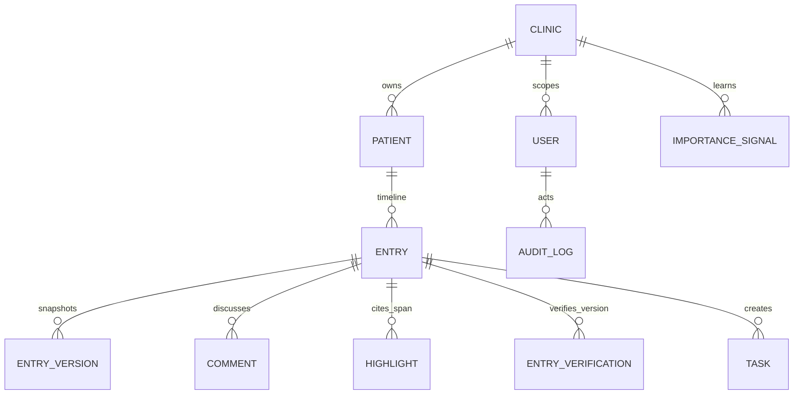

# Nightingale Care Note

Submission by **WANG QIUFENG**.

A working, synthetic-data prototype for a single longitudinal patient note: a 10-second clinical glance, role-owned timeline sections, deterministic consistency checks, bounded human review, source-linked pre-visit briefing, evidence-witnessed AI decisions, patient teach-back, access transparency, a tamper-evident audit chain, safe local attack probes, visible PHI redaction, append-only verification, interaction-learned prioritization, and a retention-policy lens.

- **Demo:** [Watch the 4:58 product walkthrough](https://youtu.be/F5CkUsmyrEs)
- **Technical brief:** [PDF](dist/Nightingale_Care_Note_Technical_Brief.pdf) · [Editable DOCX](dist/Nightingale_Care_Note_Technical_Brief.docx)

> Candidate build, not a medical device. It uses synthetic data only and does not claim production HIPAA/PDPA compliance.

## What to notice first

- **Glance view:** at most three actionable cards—an explainable cross-record conflict, a reviewable AI suggestion, and open work.
- **Consistency Watcher:** deterministic rules detect a medication–allergy conflict and open both immutable source spans side by side; no diagnosis or treatment is generated.
- **Bounded review:** a maximum of seven cards combines conflicts, AI suggestions, and due verification with a visible “why now”; there is no infinite feed or “accept all”.
- **Pre-visit Brief:** source-linked assembly of safety facts, consistency alerts, open work, patient questions, and recent changes without generating new clinical conclusions.
- **Trust by construction:** AI, clinician, staff, and patient content remain visibly distinct. AI text never silently overwrites clinician facts.
- **One-click provenance:** every stored highlight resolves to an immutable `entry_version + character span`, even after the current note changes.
- **Evidence-witnessed decisions:** only a clinician can accept or reject a suggestion, and the API requires a short-lived token bound to the exact source version and span. Editing the source invalidates the old token.
- **Trust Passport:** one panel connects the exact immutable source span, clinician authority, before/after rank, privacy-boundary evidence, and retention tier.
- **Append-only verification:** verification is an event bound to a specific entry version, never a mutable “last verified” field; the UI distinguishes fresh, due, never verified, and superseded evidence.
- **AI influence budget:** learned rank movement is clamped to ±4.0 and the Passport exposes used and remaining influence.
- **Role ownership:** staff and clinicians can view shared context but cannot overwrite one another's sections.
- **Safe collaboration:** versioned edits, metadata-only audit events, threaded comments, assignments, auditable task complete/reopen state, and deterministic conflict handling.
- **Visible AI workflow:** the scribe shows browser-memory text beside the exact redacted payload, counts, and digest before persistence. Doctor, nurse/staff, and patient sessions remain role-distinct; every patient question creates a real clinician review task.
- **Teach-back closure:** patients restate a version-bound instruction in their own words; a deterministic keyword screen flags possible gaps, but only a clinician can confirm understanding.
- **Patient access transparency:** the patient can see which clinical users opened the record in the last seven days, with role, count, and last-access time but no internal content.
- **Tamper-evident audit chain:** every content-free audit event carries `prev_hash → event_hash`; clinicians/admins can verify the SHA-256 chain without pretending it is a blockchain or external notarisation service.
- **Safe attack sandbox:** six local synthetic probes demonstrate cross-clinic isolation, patient visibility, clinician-only authority, HMAC rejection, XSS escaping/CSP, and production-secret fail-fast behavior.
- **Storage Lens:** clinicians/admins can inspect real hot/warm/cold policy classifications and their reasons without claiming that physical archival is already implemented.
- **Time machine:** clinicians/admins can reconstruct the exact note view and ten-second Glance at any past moment from immutable `entry_version` snapshots—answering the medico-legal question “what did the clinician see at decision time?” Entry content is exact; learned priority and task decision state are honestly labelled current-only approximations.

## Run it

### Docker (recommended)

```bash
export CARENOTE_SESSION_SECRET="replace-this-for-any-shared-demo"
docker compose up --build
```

Open <http://127.0.0.1:8000>. The interface starts as Dr Adrian Lim and includes a demo-only role switcher.

Container validation completed on 28 August 2026 with Docker Engine 29.7.2 and Compose 5.4.0: healthy non-root container, authenticated API, patient-filtered view, expected cross-role HTTP 403, exact PHI-redaction preview, evidence-bound clinician decisions, dual-source consistency review, bounded queue, append-only verification, pre-visit brief, teach-back, patient access transparency, audit-chain verification, safe attack probes, task completion/reopen, retention-tier coverage, and 33/33 tests passed. Machine-readable evidence is in `docs/docker_validation.json`.

For a known-clean synthetic demo state, run the guarded reset script. It refuses to act unless `--yes` is supplied and removes only this Compose project's demo volume:

```bash
./scripts/reset_demo.sh --yes
```

Normal upgrades are non-destructive: the seed routine adds missing synthetic demo records with `INSERT OR IGNORE` and preserves existing demo interactions.

### Local, dependency-free

Python 3.9+ is sufficient; the prototype has no runtime package dependencies.

```bash
./scripts/run_demo.sh
```

### Local TLS demonstration

```bash
./scripts/generate_dev_cert.sh
export CARENOTE_SESSION_SECRET="replace-this-for-any-shared-demo"
docker compose -f compose.tls.yaml up --build
```

Open `https://localhost:8443`. The certificate is self-signed and for local demonstration only. A production deployment would terminate TLS at a managed ingress and use a managed encrypted database/volume.

## Demo identities

| View | Synthetic actor | What the server permits |
|---|---|---|
| Clinician | Dr Adrian Lim | All clinic-scoped context; edit clinician sections; sole accept/reject authority; highlight/comment/revert; complete/reopen clinic tasks |
| Staff | Jia Chen | Clinic-scoped context; add/edit staff sections; suggest highlights; comment/assign; update only own/unassigned tasks |
| Patient | Maya Tan | Only patient-facing instructions; never internal comments or raw AI notes |
| Admin | Nora Admin | Clinic-scoped oversight/audit; cannot author clinical content |

The role switcher requests a short-lived HMAC-signed demo session. Authorization checks occur in the service layer on every read/write. Setting `DEMO_MODE=0` disables the role-switch endpoint; startup then fails fast if the session secret is missing or still uses a known demo default. A production identity provider would mint equivalent sessions.

## Architecture



The dependency-free HTTP layer is deliberately replaceable. Production evolution: OIDC/SSO → FastAPI/Node service → PostgreSQL with row-level security → encrypted object storage for cold versions and audio → managed KMS/audit sink.

## Data relationships



`Highlight(entry_id, entry_version, start_offset, end_offset, quote, status, decided_by, decided_at)` is the trust anchor. Resolution reads the immutable version, verifies the exact quote, and returns a stable timeline anchor. The Trust Passport issues a short-lived HMAC evidence token that binds actor, highlight, immutable version, offsets, and quote digest; the decision endpoint rejects missing, tampered, expired, or superseded evidence. Accepted and rejected decisions remain queryable; a rejected item is removed from Glance but not erased from its source entry or audit trail. `EntryVerification(entry_id, entry_version, verified_by, verified_at)` provides the same version-bound semantics for human re-verification.

## Server-side RBAC

UI hiding is cosmetic; `CareNoteService` enforces these rules:

- All staff, clinician, and admin access is `clinic_id` scoped.
- A patient user is bound to exactly one `patient_id`.
- Patient reads require `visibility='patient'`, reject `ai_*` entries, and omit internal comments/highlights/tasks.
- Patient access reports expose only content-free viewer metadata for the bound patient.
- `entry.author_role` must equal the editing actor's role. System/AI entries are immutable.
- Only clinicians may make the one final accept/reject decision on an AI highlight or consistency alert; replayed decisions receive HTTP `409`, and a decision without witnessed current-version evidence is rejected.
- Task complete/reopen is restricted to a clinic clinician or the assigned/unassigned staff member; actor and time are stored and audited.
- Admin has oversight but cannot author or edit clinical content.
- Assignees and comments must remain inside the clinic.

## Revision and concurrent-edit strategy

- Every create writes `entry_versions(version=1)`.
- An edit requires `expected_version` inside a `BEGIN IMMEDIATE` transaction.
- Success increments the version and appends a full immutable snapshot.
- Revert never deletes history; it creates a new version containing the chosen prior content.
- Different role-owned sections are separate entries and can save concurrently.
- Two writes to the same section/version resolve deterministically: one saves; the other receives HTTP `409` with the current version. Nothing is silently overwritten.

## No-PHI LLM boundary

`carenote/security.py::prepare_llm_payload` is the only intended outbound LLM boundary. Before any adapter sees text, it removes:

- known patient/actor names plus labelled names;
- Singapore NRIC/FIN and labelled generic identifiers;
- Singapore phone numbers.

Only the redacted payload, redaction counts, and SHA-256 digest proceed. The preview endpoint performs no persistence and no external call, letting the reviewer see the privacy boundary before creating a note. Audit logs contain the digest/counts—not transcripts, note bodies, quotes, or prompts. The included scribe is a deterministic local stub, so the demo sends no data externally.

## Explainable importance learning

Base priority combines recency, explicit risk, unresolved tasks, tagged entities, and clinician authorship. When a clinician accepts or manually creates a highlight—or comments on an AI note—the system raises bounded weights for similar keywords/entities. Structured clinical entities receive the full signal while generic keyword matches are normalized to one quarter, preventing common words from dominating. Rejected suggestions reduce their weights. Total learned influence is clamped to ±4.0; the UI exposes `base_score + learned_boost`, base/current rank, and an influence-budget meter. Clinicians still retain final accept/reject control.

This is intentionally a transparent ranking aid, not an autonomous clinical decision system.

## Teach-back, transparency, and audit integrity

Patient-facing instructions expose a teach-back action only to the bound patient. The response is stored separately from the instruction, tied to the exact instruction version, screened by deterministic concept matching, and queued for a clinician's one final `confirmed` or `needs_clarification` decision. If the instruction changes first, the old attempt cannot be confirmed.

Every top-level clinical-user care-note read records content-free access metadata. The bound patient can inspect a seven-day grouped report; internal note text, comments, prompts, and audit metadata are never returned. Separately, audit events form a per-clinic SHA-256 chain over canonical metadata. Startup backfills only unhashed legacy rows and never rewrites existing hashes, so later corruption remains detectable.

## Hybrid storage/data decay policy

The clinician/admin **Storage Lens** calls `carenote/decay.py` to preview three storage tiers:

- **Hot (≤90 days or safety protected):** full content indexed for instant glance/timeline use.
- **Warm (91–365 days):** structured summary indexed; full immutable version retained.
- **Cold (>365 days):** compressed encrypted archive; provenance stub stays queryable.

Critical/high-risk entries and allergy/medication/safety-net entities are never decayed solely due to age. Seeded synthetic history deliberately exercises all three tiers. The prototype calculates policy but does not physically move records; production would use PostgreSQL + encrypted object storage with retention/legal-hold controls.

## Tests

Run every required micro-test plus authentication and redaction tests:

```bash
./scripts/test.sh
```

Included exact challenge files:

- `tests/test_rbac_scope.py`
- `tests/test_revision_history.py`
- `tests/test_highlight_provenance.py`
- `tests/test_concurrent_edits.py`
- `tests/test_self_learning_importance.py`
- `tests/test_data_decay.py`
- `tests/test_task_workflow.py`
- `tests/test_review_workflow.py`
- `tests/test_trust_extensions.py`

Additional: `test_phi_redaction.py`, `test_auth_session.py`, and `test_time_machine.py`.

The current suite contains **33 passing tests**.

## Warm-path latency measurement

```bash
python3 scripts/benchmark_glance.py
```

Reference run on the candidate Mac: 300 measured reads after 20 warm-ups; median **6.249 ms**, P95 **6.622 ms**, max **19.194 ms**. This measures service logic + SQLite queries + consistency/review assembly + JSON-ready serialization only.

## End-to-end HTTP latency measurement

With the Docker demo running:

```bash
python3 scripts/benchmark_http.py
```

Reference run against the seeded record: 300 authenticated HTTP reads after 20 warm-ups; median **3.575 ms**, P95 **4.721 ms**, max **5.836 ms**. This includes local HTTP, signed-session verification, RBAC, SQLite, consistency/review assembly, and JSON serialization. It excludes browser rendering and is not a production network claim; deployed P95 still requires OpenTelemetry and load testing in the target environment. Machine-readable evidence is in `docs/http_latency_report.json`.

## API surface

- `POST /api/demo/session` — demo-only signed session
- `GET /api/care-note?patient_id=...`
- `GET /api/previsit-brief?patient_id=...`
- `GET /api/patient-access-report?patient_id=...`
- `GET /api/audit/verify?patient_id=...`
- `POST /api/security/sandbox`
- `POST /api/patients/:id/entries`
- `PATCH /api/entries/:id`
- `GET /api/entries/:id/versions`
- `POST /api/entries/:id/revert`
- `POST /api/entries/:id/comments`
- `POST /api/entries/:id/verify`
- `POST /api/entries/:id/teach-back`
- `GET /api/teach-backs/:id`
- `POST /api/teach-backs/:id/decision`
- `PATCH /api/comments/:id`
- `POST /api/patients/:id/highlights`
- `POST /api/highlights/:id/decision`
- `GET /api/highlights/:id/source`
- `GET /api/highlights/:id/passport`
- `GET /api/conflicts/:id/passport`
- `POST /api/conflicts/:id/decision`
- `PATCH /api/tasks/:id`
- `POST /api/patients/:id/scribe`
- `POST /api/patients/:id/redaction-preview`
- `GET /api/audit?patient_id=...`
- `GET /api/decay-preview?patient_id=...`
- `GET /api/care-note/as-of?patient_id=...&at=...`

## Scope decisions

Built deeply: glanceability, server-side role/clinic policy, dual-source consistency review, a bounded queue, source-resolving AI highlights, evidence-witnessed decisions, append-only verification, a source-linked pre-visit brief, auditable task transitions, revisions/revert, comments, concurrency safety, visible PHI gateway, bounded rank influence, and data-decay policy.

Deferred deliberately: production OIDC, real EHR/FHIR integration, CRDT rich-text editing, clinical terminology service, SQLCipher/managed KMS, and ambient audio transcription/diarization. These need clinical governance and infrastructure beyond a 72-hour prototype and are not faked.
