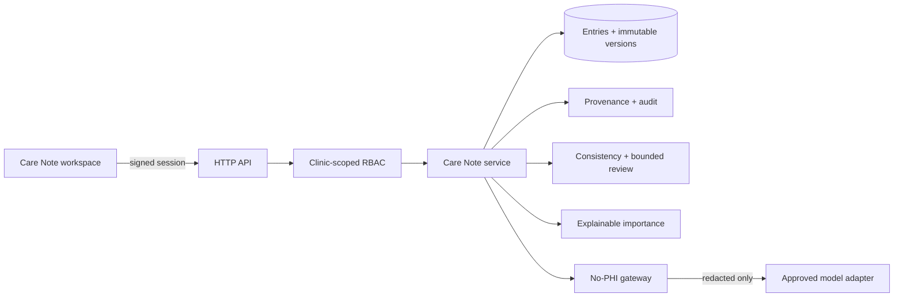

# Nightingale Care Note — Technical Brief

Built by **Qiufeng Wang**.

## Product thesis

The Care Note is a communication and trust layer beside the EHR, not another free-form document. Its primary job is to let a clinician understand what changed, what is risky, and what must happen next in under ten seconds—without erasing the different authority levels of patient, staff, clinician, and AI contributions.

The prototype therefore makes eight opinionated choices. First, the Glance View is capped at three cards and a bounded review queue is capped at seven—there is no infinite clinical feed or “accept all”. Second, a deterministic Consistency Watcher detects cross-record conflicts and requires the reviewer to witness both immutable source spans; it never diagnoses or prescribes. Third, every role owns separate timeline entries; collaboration occurs through comments, assignments, and auditable task transitions rather than shared overwrites. Fourth, every AI-derived highlight is a citation into an immutable note version, not copied text detached from its origin. Fifth, a Trust Passport joins that source to clinician authority, verification freshness, a bounded influence budget, privacy-boundary evidence, and retention policy. Sixth, patient teach-back is bound to one instruction version and remains pending until a clinician confirms understanding. Seventh, patients can see content-free access metadata while reviewers can verify a tamper-evident audit chain and run safe local security probes. Eighth, a Time Machine reconstructs the exact note view and ten-second Glance at any past instant from immutable entry snapshots—answering what a clinician saw at decision time—while honestly labelling learned priority and task decision state as current-only. Only clinicians can make final AI, consistency, and teach-back decisions.

## Architecture and flow

The browser obtains a short-lived signed session and calls a dependency-free HTTP API. Every API method loads the actor server-side, checks patient binding or clinic scope, then delegates to one domain service. The service owns role rules, optimistic locking, provenance resolution, deterministic consistency checks, bounded review assembly, PHI redaction, importance learning, and content-free audit events. SQLite provides ACID transactions for the prototype; its schema maps directly to PostgreSQL for production.

The demo role switch is intentionally explicit and is disabled by setting `DEMO_MODE=0`. Production replaces it with OIDC/SSO while retaining the same authorization service. TLS can be exercised with the supplied TLS compose file. Production storage moves to managed PostgreSQL/object storage with encryption at rest, KMS-managed keys, backups, and legal-hold/retention policy.

## Schema and trust relationships

- **Patient** belongs to one clinic and owns a chronological set of **Entries**.
- **Entry** stores author role, type, visibility, section key, current content/version, entities, risk, timestamp, and source pointer.
- **EntryVersion** is an append-only full snapshot. Edit increments; revert creates another version.
- **Comment** points to an entry and carries author, optional assignee, and resolve state.
- **Task** points to its source entry and stores assignee, status, completion actor, and completion time; complete/reopen transitions are audited.
- **Highlight** cites `entry_id + entry_version + start/end offsets + quote` and records final `status + decided_by + decided_at`; resolution verifies the quote against the immutable version.
- **EntryVerification** is an append-only event bound to `entry_id + entry_version`; freshness never relies on a mutable `updated_at` field.
- **ConsistencyDecision** records acknowledgement/dismissal after two source versions are witnessed through an actor-bound, expiring evidence token.
- **ImportanceSignal** stores bounded, clinic-local weights learned from accepted/rejected highlights and clinician interaction.
- **TeachBackAttempt** stores the patient's own-word response separately, binds it to an instruction version, records deterministic concept coverage, and retains the clinician's final decision.
- **AuditLog** stores actor/action/entity/version metadata only; clinical bodies, comments, transcripts, and prompts are excluded. Each event carries the previous and current SHA-256 hash.

This layout prevents a later edit from breaking an earlier citation and keeps AI summaries distinct (`author_role=system` plus typed `ai_*_summary`). The Trust Passport queries these existing records rather than creating a second truth store. Clinician edits take precedence by being separately authored, higher-authority entries; contradictions are visible rather than silently merged.

## RBAC, privacy, and concurrency

All authorization is server-side. Patients are bound to one patient ID and receive only `visibility=patient` entries; raw AI entries, internal comments, tasks, highlights, conflict review, and audit data are rejected even if a URL is guessed. Staff, clinicians, and admins are clinic-scoped. A staff-authored section can be edited only by staff; clinician sections only by clinicians; system entries are immutable; admin is oversight-only. Before accepting a highlight or resolving a consistency alert, the clinician must open the evidence surface; the server issues a short-lived HMAC token bound to actor, source version(s), offsets, and quote digest. Missing, tampered, expired, replayed, or superseded evidence is rejected. Task transitions are limited to a clinic clinician or the assigned/unassigned staff member and write content-free audit metadata.

The LLM boundary accepts text only through `prepare_llm_payload`. It removes known/labelled names, Singapore NRIC/FIN or labelled IDs, and Singapore phone formats before an adapter can receive the text. A preview endpoint performs no persistence or external call and shows browser-memory text beside the exact redacted payload, counts, and SHA-256 digest. The current scribe is local and deterministic, so no text leaves the machine. Logs contain only the digest and redaction counts. Top-level clinical-user reads write content-free access events; the bound patient sees only a seven-day grouped viewer report. Audit metadata is canonicalized into a per-clinic `prev_hash → event_hash` chain; startup never rewrites existing hashes, so later modification is detectable. This is deliberately described as tamper-evident, not as blockchain-grade prevention.

Concurrent editing uses section ownership plus optimistic locking. Each edit sends `expected_version` inside a write transaction. Different sections save independently. Competing edits to one section yield one success and one deterministic HTTP 409 response with the new current version—never last-write-wins loss.

## Importance learning and data decay

Priority is transparent: time decay, explicit risk, unresolved tasks, clinical entities, and clinician authorship form the base. Clinician acceptance/manual highlighting/commenting increases bounded weights for matching keywords/entities; rejection decreases them. Total learned influence is clamped to ±4.0 and the UI exposes the used/remaining budget alongside base score, learned boost, and rank movement. Task completion removes the unresolved-work boost. This is a ranking aid, not a diagnostic model; humans can accept or reject every suggestion.

Review uses the same “important facts return” principle as spaced repetition without turning clinical work into a game. Prototype review windows are explicit policy—not clinical guidance—and are computed from risk and last verification of the current version. The queue combines overdue/never-verified facts, unresolved AI suggestions, consistency alerts, and pending teach-back attempts, stops at seven, explains why each card returned, and ends at one human decision. A source-linked pre-visit brief assembles safety facts, alerts, work, questions, and recent changes without generating new medical conclusions. Teach-back uses deterministic concept coverage only to flag a possible gap; it never generates medical instructions, and a changed instruction invalidates the old review attempt.

The hybrid-storage policy keeps ≤90-day content and all high-risk/allergy/medication/safety-net facts hot. Entries aged 91–365 days retain indexed structured summaries with full immutable versions. Older low-risk content moves to encrypted cold storage while a provenance stub remains queryable. A clinician/admin Storage Lens exposes the computed tier, age, protection flag, and policy for seeded hot/warm/cold history. The prototype previews classifications but intentionally does not fake physical archival.

## Validation, performance, and deliberate scope

Thirty-three automated tests cover the requested RBAC, revision/revert, provenance, and concurrency cases plus stale/tampered evidence-token rejection, dual-source consistency review, bounded queues, append-only version-bound verification, pre-visit assembly, no-persistence redaction preview, patient-question task creation, clinician-only final AI decisions, retained rejection trails, the joined Trust Passport, signed-session tamper rejection, task authority/completion/reopen, teach-back version invalidation, patient access transparency, audit-chain tamper detection, safe local attack probes, point-in-time entry reconstruction, and all three retention tiers. On the candidate Mac, 300 warm service reads measured median 6.249ms and P95 6.622ms. A separate 300-read Docker HTTP benchmark measured median 3.575ms and P95 4.721ms, including signed-session verification, RBAC, SQLite, consistency/review assembly, and JSON serialization. Both are below the ≤300ms target; neither claims browser-render or production-network performance.

Within 72 hours, depth was prioritized over breadth: the prototype implements the trust-critical collaboration path end to end. Deferred work is explicit: real EHR/FHIR exchange, production OIDC and PostgreSQL RLS, CRDT rich text, terminology service, managed KMS/retention controls, and ambient voice diarization. None is represented as complete without clinical, security, and operational validation.
